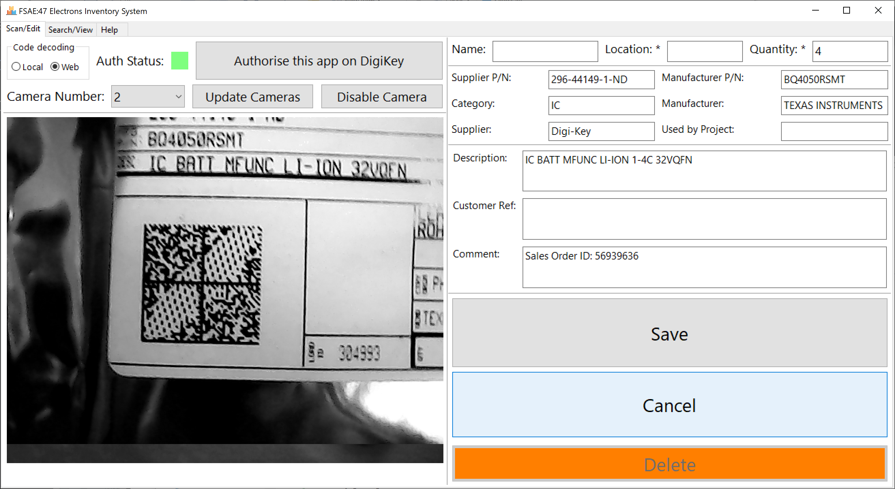
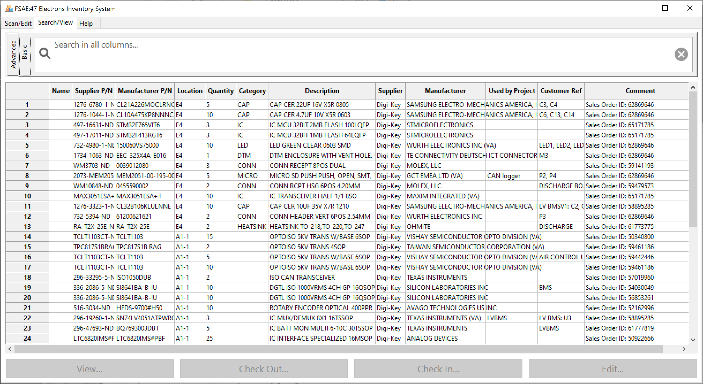
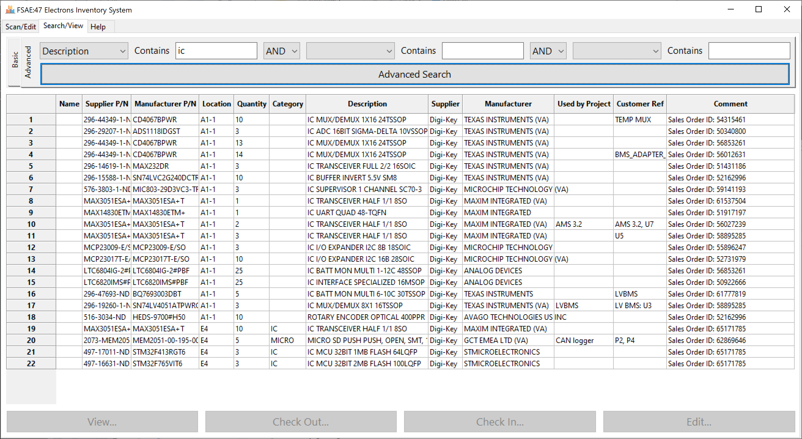

# Electrons Inventory System #

### What is this repository for? ###

This is the inventory system initially written to manage the electronic components used by the electronics subgroup in the [University of Auckland Formula SAE Team](https://www.fsae.co.nz/). It allows the user to scan DigiKey bags to add components into the system, as well as to search and edit the information.

### Current state of the project ###

Currently, the system has working basic features and the rest is still a work in progress. The features include:

* Adding components by scanning DigiKey datamatrix code

* Adding components by manual entry

* Searching for a part by any keyword (basic search) or by fields (advanced search). Results are currently limited to 200

* Edit component information by code scanning or search

Future features that I would like to implement include:

* Packaged executable for Windows

* Fully working component check-in and check-out feature

* Logging to a file

* Multi-page search results display with no limits

* Automatic component deduction by project bill of materials

* Automatic scheduled database backup

* Data matrix code generation and label printer support

There are also room for improvements in the usability of the GUI.

### Cross-platform support ###

Since this is app is written in pure python, the app will run across different platforms. However, as `winsound` is used to play the beeping sound when a code is detected, this feature is only available on Windows.

### Required hardware ###

* USB webcam for scanning codes, one that can adjust the focus (either manually or auto-focus) is strongly recommended.

The system was developed using a 640x480 USB webcam with an adjustable lens. Cameras with different resolutions should work, although higher resolution cameras might be harder to scan, as the datamatrix code detection algorithm might time out more easily having more data to process.

### How do I get it set up? ###

At the moment, the system will be run directly using python. This means that some external libraries the project depends on need to be installed via pip. There has been progress in packaging the app into a stand-alone executable, but it's not ready yet.

The required libraries list can be found in the requirements.txt file.

#### Setting up Digi-Key app to use their API (this section is still WIP) ####

This is only necessary if you're dealing with Digi-Key parts and need to use the API to fetch information about a component.

1. Go to the [Digi-Key API developer portal](https://developer.digikey.com/).
2. Login with your normal Digi-Key account, or register.
3. Create an organization.

### Screenshots ###

Most of the entry fields are automatically populated after scanning a code, except "Name", "Location", and "Used by Project". Most of the information shown below is straight from the Digi-Key API response, except the Category and Supplier. The Supplier field was hard-coded to fill "Digi-Key" when scanning a supported code, and the Category field is taken as the first word in the description, which will work for a fairly big range of parts.

### FAQ ###

#### Does it work with parts from other suppliers? ####

Sort of. The datamatrix code of Mouser bags can work sometimes, in the Local decoding mode. Usually, only the manufacturer part number is available from the code. Codes on Yageo reels were also tested to partially work in Local mode. The Web mode is for Digi-Key codes only.

#### What about older Digi-Key codes, like the barcode or the PDF417 code? ####

Currently, this app only supports the latest (v3), datamatrix code from Digi-Key. Information about those parts can still be typed in manually.

#### Where are the records stored? ####

The component records are stored in a SQLite database, at `AppData/inventory.db`. Having a local database means no web hosting is required, making the app suitable for hobbyists and small teams like the UoA FSAE team.

#### Can this app run on a network location? ####

Yes. One thing to keep in mind is that SQLite does not support multiple writes at the same time. Multiple instances of the application can read the database at once, but not writing to it. The [SQLite FAQ page](https://sqlite.org/faq.html#q5) has more details.

#### What's with the server private key? ####

The Digi-Key API requires that the callback URL for the OAuth flow to be using HTTPS. Since the app runs a local web server to handle the callback request, to serve HTTPS it'll need a private key. It's not ideal, but that's what I came up with for now.
